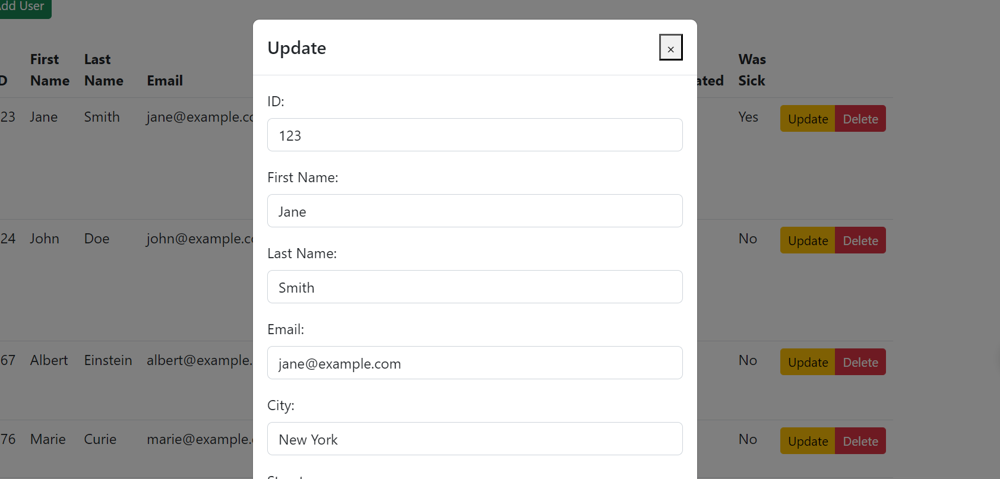
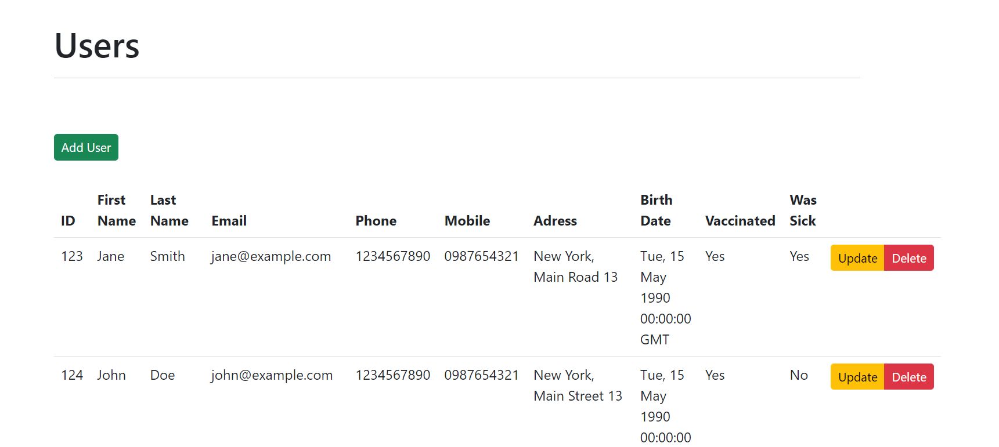
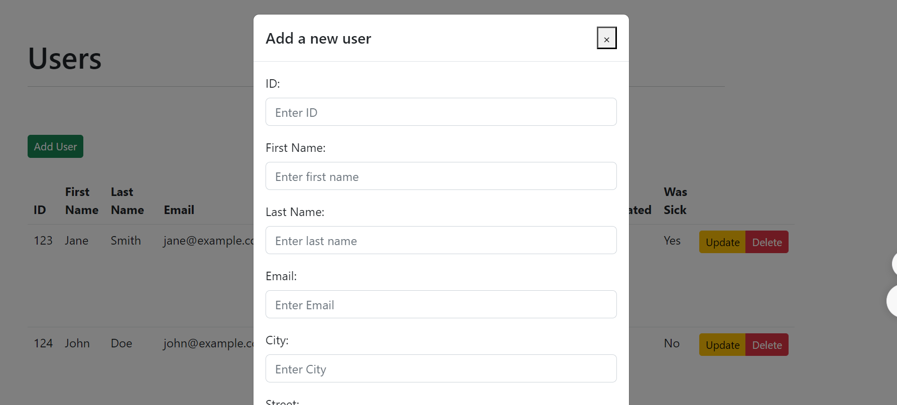

# HADASIM Program Project

#### The project manages an HMO. Supports getting members personal information, adding new members updating existing members and deleting members.

## Client
#### The client is written with Vue.js and uses bootstrap for dtyling and axios for handling http requests.

### How to use -
open in vs code

open terminal in vue-client folder and run `npm run serve`

## Server 
#### The server is written with Python and uses flask to run server, flask_restful to implement api and pymongo for interaction with MongoDB database.

### How to use -
open in PyCharm

run app.py from PyCharm

## TO DO:
* Add validation 
* Test put request
* Refactor and tidy client
